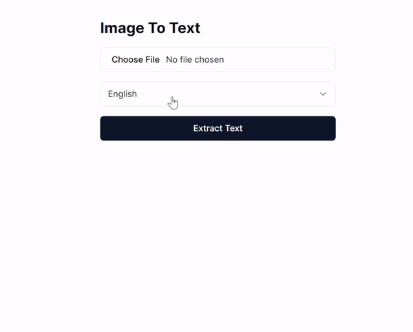

# Service OCR

## Description

Service OCR est une application web qui permet d'importer des images et de les convertir en texte grâce au moteur OCR Tesseract. Elle prend en charge plusieurs langues et propose une interface simple pour extraire, prévisualiser et copier le texte reconnu.

## Fonctionnalités

- Import d'images depuis un fichier local ou une URL
- Prise en charge de plusieurs langues de reconnaissance OCR
- Aperçu de l'image en temps réel
- Affichage du texte extrait
- Copie du texte extrait dans le presse-papiers
- Notifications toast pour les actions utilisateur
- Indicateur de chargement pendant le traitement OCR

## Stack technique

- Next.js
- React
- Tesseract.js
- Tailwind CSS

## Prise en main

### Prérequis

- Node.js 14.x ou version supérieure
- npm 6.x ou version supérieure

### Installation

Clonez le dépôt :

```bash
git clone https://github.com/SophieRasoamialy/ocr-service.git
cd ocr-service
```

Installez les dépendances :

```bash
npm install
```

### Lancer l'application en développement

Démarrez le serveur de développement :

```bash
npm run dev
```

Ouvrez ensuite votre navigateur à l'adresse [http://localhost:3000](http://localhost:3000).

### Construire pour la production

Créez une version de production :

```bash
npm run build
```

Lancez le serveur de production :

```bash
npm start
```

## Déploiement

Vous pouvez déployer cette application sur tout service d'hébergement compatible avec Node.js. Par exemple, elle peut être déployée sur Vercel en suivant leur guide de déploiement.

## Utilisation

1. Sélectionnez une image à l'aide du champ d'import de fichier ou indiquez une URL d'image.
2. Choisissez la langue à utiliser pour la reconnaissance OCR dans le menu déroulant.
3. Cliquez sur le bouton **Convert to Text** pour lancer l'extraction.
4. Consultez le texte extrait affiché sous le bouton.
5. Copiez le résultat dans le presse-papiers si nécessaire.

## Langues prises en charge

L'application prend notamment en charge les langues suivantes :

- Anglais
- Français
- Espagnol
- Allemand
- Italien
- Portugais
- Néerlandais
- Russe
- Chinois simplifié
- Chinois traditionnel
- Japonais
- Coréen
- Arabe
- Et bien d'autres langues prises en charge par Tesseract.js

## Conseils pour de meilleurs résultats OCR

- Utilisez des images nettes, bien éclairées et avec un bon contraste.
- Évitez les photos inclinées, floues ou contenant trop de bruit visuel.
- Sélectionnez la langue correspondant au texte présent dans l'image.
- Recadrez l'image autour du texte lorsque c'est possible.

## Contribution

Les contributions sont les bienvenues ! Vous pouvez ouvrir une issue ou soumettre une pull request pour proposer des améliorations, corriger des bugs ou enrichir la documentation.

## Remerciements

- [Tesseract.js](https://tesseract.projectnaptha.com/) pour le moteur OCR
- [Next.js](https://nextjs.org/) pour le framework React
- [Tailwind CSS](https://tailwindcss.com/) pour le style


